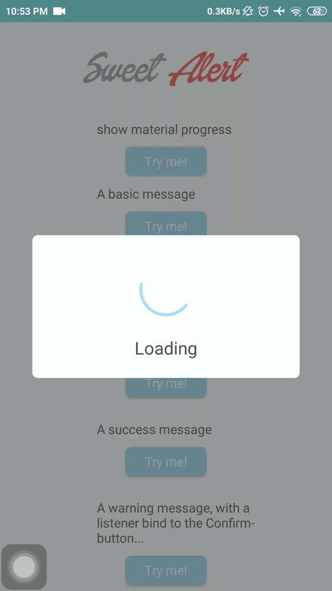
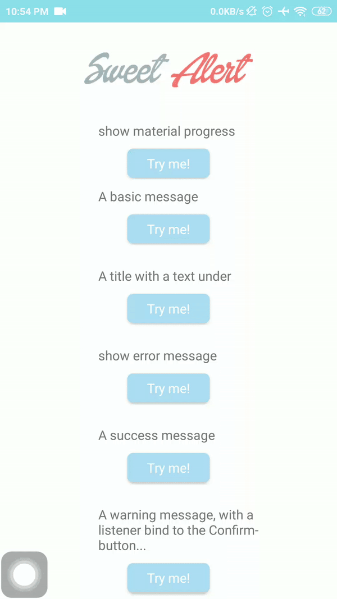
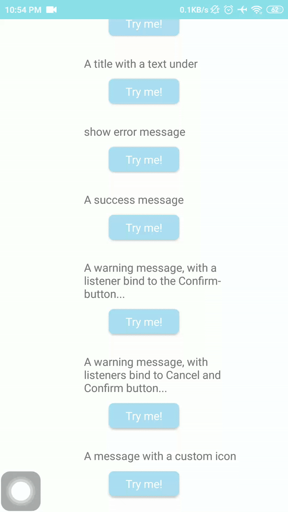

# Sweet Alert Dialog

[](https://www.android.com)
[](https://www.apache.org/licenses/LICENSE-2.0.html)
[](https://docs.gradle.org/current/release-notes)
[](https://java-lang.github.io/awesome-java)

A beautiful Sweet Alert Dialog Examples in Java using Library.

# Source
Repo to demonstrate Sweet Alert Dialog in Android. This is a follow up on the github at :

[SweetAlertDialog](https://github.com/Cazaea/SweetAlertDialog)

# Demo App

[Demo Download](https://github.com/achmadqomarudin/SweetAlertDialog/screenshots/app-demo.apk)

<table style="width:100%">
  <tr>
    <th>Example 1</th>
    <th>Example 2</th>
  </tr>
  <tr>
    <td></td>
    <td></td>
  </tr>
  <tr>
    <th>Example 3</th>
    <th>Example 4</th>
  </tr>
  <tr>
    <td></td>
    <td></td>
  </tr>
  </table>

# Setup
The simplest way to use SweetAlertDialog is to add the library as aar dependency to your build.

**Gradle**(Module)

```
dependencies {

        implementation 'com.github.cazaea:sweet-alert-dialog:1.0.0'
    }
```

**Gradle**(Project)

```
allprojects {
    repositories {
        ...
        maven { url 'https://jitpack.io' }
        ...
    }
}
```

# Usage
show material progress

```
SweetAlertDialog pDialog = new SweetAlertDialog(this, SweetAlertDialog.PROGRESS_TYPE);
    pDialog.getProgressHelper().setBarColor(Color.parseColor("#A5DC86"));
    pDialog.setTitleText("Loading");
    pDialog.setCancelable(false);
    pDialog.show();
```


You can customize progress bar dynamically with materialish-progress methods via **SweetAlertDialog.getProgressHelper()**:

 - resetCount()
 - isSpinning()
 - spin()
 - stopSpinning()
 - getProgress()
 - setProgress(float progress)
 - setInstantProgress(float progress)
 - getCircleRadius()
 - setCircleRadius(int circleRadius)
 - getBarWidth()
 - setBarWidth(int barWidth)
 - getBarColor()
 - setBarColor(int barColor)
 - getRimWidth()
 - setRimWidth(int rimWidth)
 - getRimColor()
 - setRimColor(int rimColor)
 - getSpinSpeed()
 - setSpinSpeed(float spinSpeed)

thanks to the project [materialish-progress](https://github.com/pnikosis/materialish-progress) and [@pedant](https://github.com/pedant) participation.

more usages about progress, please see the sample.

A basic message：

    new SweetAlertDialog(this)
        .setTitleText("Here's a message!")
        .setConfirmText("OK") // Do not set the property, do not show the button
        .show();

A title with a text under：

    new SweetAlertDialog(this)
        .setTitleText("Here's a message!")
        .setContentText("It's pretty, isn't it?")
        .setConfirmText("OK")
        .show();

A error message：

    new SweetAlertDialog(this, SweetAlertDialog.ERROR_TYPE)
        .setTitleText("Oops...")
        .setContentText("Something went wrong!")
        .setConfirmText("OK")
        .show();

A warning message：

    new SweetAlertDialog(this, SweetAlertDialog.WARNING_TYPE)
        .setTitleText("Are you sure?")
        .setContentText("Won't be able to recover this file!")
        .setConfirmText("Yes,delete it!")
        .show();

A success message：

    new SweetAlertDialog(this, SweetAlertDialog.SUCCESS_TYPE)
        .setTitleText("Good job!")
        .setContentText("You clicked the button!")
        .show();

A message with a custom icon：

    new SweetAlertDialog(this, SweetAlertDialog.CUSTOM_IMAGE_TYPE)
        .setTitleText("Sweet!")
        .setContentText("Here's a custom image.")
        .setCustomImage(R.drawable.custom_img)
        .show();

Bind the listener to confirm button：

    new SweetAlertDialog(this, SweetAlertDialog.WARNING_TYPE)
        .setTitleText("Are you sure?")
        .setContentText("Won't be able to recover this file!")
        .setConfirmText("Yes,delete it!")
        .setConfirmClickListener(new SweetAlertDialog.OnSweetClickListener() {
            @Override
            public void onClick(SweetAlertDialog sDialog) {
                sDialog.dismissWithAnimation();
            }
        })
        .show();

Show the cancel button and bind listener to it：

    new SweetAlertDialog(this, SweetAlertDialog.WARNING_TYPE)
        .setTitleText("Are you sure?")
        .setContentText("Won't be able to recover this file!")
        .setCancelText("No,cancel plx!")
        .setConfirmText("Yes,delete it!")
        .showCancelButton(true)
        .setCancelClickListener(new SweetAlertDialog.OnSweetClickListener() {
            @Override
            public void onClick(SweetAlertDialog sDialog) {
                sDialog.cancel();
            }
        })
        .show();

 **Change** the dialog style upon confirming：

    new SweetAlertDialog(this, SweetAlertDialog.WARNING_TYPE)
        .setTitleText("Are you sure?")
        .setContentText("Won't be able to recover this file!")
        .setConfirmText("Yes,delete it!")
        .setConfirmClickListener(new SweetAlertDialog.OnSweetClickListener() {
            @Override
            public void onClick(SweetAlertDialog sDialog) {
                sDialog
                    .setTitleText("Deleted!")
                    .setContentText("Your imaginary file has been deleted!")
                    .setConfirmText("OK")
                    .setConfirmClickListener(null)
                    .changeAlertType(SweetAlertDialog.SUCCESS_TYPE);
            }
        })
        .show();

# License

```
    Copyright (C) Achmad Qomarudin

    Licensed under the Apache License, Version 2.0 (the "License");
    you may not use this file except in compliance with the License.
    You may obtain a copy of the License at

       http://www.apache.org/licenses/LICENSE-2.0

    Unless required by applicable law or agreed to in writing, software
    distributed under the License is distributed on an "AS IS" BASIS,
    WITHOUT WARRANTIES OR CONDITIONS OF ANY KIND, either express or implied.
    See the License for the specific language governing permissions and
    limitations under the License.
```
